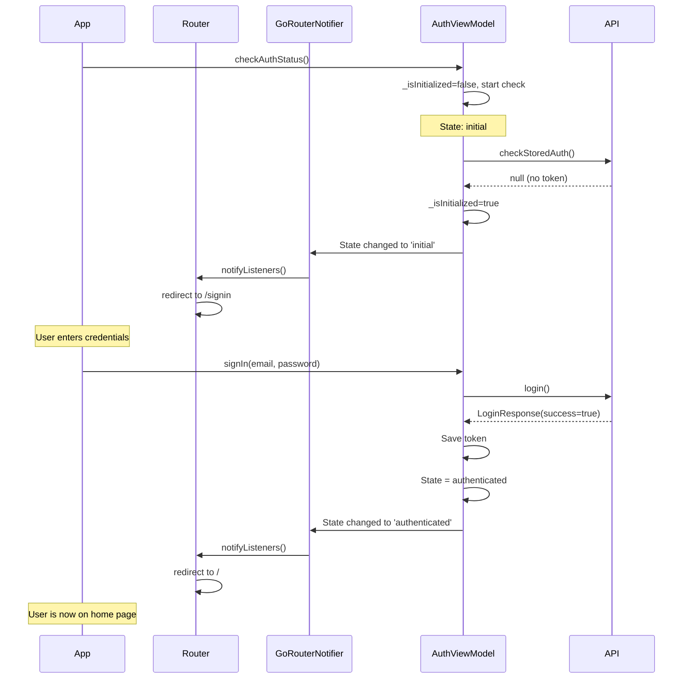

# Correcciones al Flujo de Autenticación y Validación de Tokens

## Fecha: 5 de Noviembre de 2025

## Actualización Crítica - Congelamiento Resuelto

### **Problema Principal: App Congelada Después del Login** 🔴 → 🟢

**Síntoma:** La app se congelaba después de un login exitoso, mostrando:
```
🔀 Router redirect: location=/signin, authInit=false, authStatus=AuthStatus.loading, isSignInPage=true
🔀 Router: Allowing access to /signin
✅ AuthViewModel: Estado actualizado exitosamente
🎮 AuthController: Mostrando notificación de éxito
```

**Causa Raíz:**
1. El router no estaba escuchando cambios de estado de autenticación correctamente
2. Después del login, el estado cambiaba pero el router no se actualizaba
3. El `Overlay` del contexto se perdía durante la transición

**Solución Implementada:**

#### 1. RefreshListenable con ChangeNotifier
Implementado `_GoRouterNotifier` que escucha cambios tanto en `authViewModelProvider` como en `authInitProvider`:

```dart
class _GoRouterNotifier extends ChangeNotifier {
  final Ref _ref;
  bool _initialized = false;

  _GoRouterNotifier(this._ref) {
    // Listen to auth state changes
    _ref.listen<AuthState>(
      authViewModelProvider,
      (previous, next) {
        print('🔔 GoRouterNotifier: Auth state changed from ${previous?.status} to ${next.status}');
        notifyListeners(); // ← Esto dispara la re-evaluación del router
      },
    );
    
    // Listen to auth initialization
    _ref.listen<AsyncValue<bool>>(
      authInitProvider,
      (previous, next) {
        print('🔔 GoRouterNotifier: Auth init changed');
        if (next.hasValue && !_initialized) {
          _initialized = true;
          notifyListeners();
        }
      },
    );
  }
}
```

#### 2. Router con refreshListenable
```dart
final routerProvider = Provider<GoRouter>((ref) {
  final notifier = _GoRouterNotifier(ref);
  
  return GoRouter(
    initialLocation: '/signin',
    debugLogDiagnostics: true,
    refreshListenable: notifier, // ← Clave para la reactividad
    routes: [...]
  );
});
```

#### 3. Notificaciones con PostFrameCallback
Para evitar que las notificaciones intenten mostrarse cuando el contexto ya no es válido:

```dart
if (success) {
  WidgetsBinding.instance.addPostFrameCallback((_) {
    if (context.mounted) { // ← Verifica que el context siga válido
      CupertinoNotificationBanner.show(
        context,
        message: 'Inicio de sesión exitoso',
        type: NotificationType.success,
        showLogo: true,
        duration: const Duration(seconds: 2),
      );
    }
  });
}
```

## Problemas Identificados y Solucionados

### 1. **Race Condition en el Router** ❌ → ✅
**Problema:** El router se reconstruía múltiples veces durante el proceso de login, causando redirecciones inconsistentes.

**Solución:**
- Simplificada la lógica de redirección en `app_router.dart`
- Eliminados estados intermedios innecesarios
- Ahora solo dos estados principales: `authenticated` y `not authenticated`
- Cambio de `initialLocation` de `/` a `/signin` para evitar flash de contenido protegido

```dart
// ANTES - Lógica compleja con múltiples condiciones
if (authState.status == AuthStatus.loading) return null;
if (authState.status == AuthStatus.error) { /* ... */ }
if (authState.status == AuthStatus.initial) { /* ... */ }
// ... más condiciones

// AHORA - Lógica simplificada y clara
final isAuthenticated = authState.status == AuthStatus.authenticated;
if (isAuthenticated && isSignInPage) return '/';
if (!isAuthenticated && !isSignInPage) return '/signin';
return null;
```

### 2. **Estado de Loading Mal Manejado** ❌ → ✅
**Problema:** El estado inicial del `AuthViewModel` era `loading`, causando que el router esperara indefinidamente.

**Solución:**
- Cambiado estado inicial de `loading` a `initial`
- Agregado flag `_isInitialized` para prevenir múltiples inicializaciones
- Eliminado el cambio de estado a `loading` durante `checkAuthStatus()`

```dart
// ANTES
AuthViewModel({required this.repository}) : super(const AuthState.loading());
state = const AuthState.loading(); // Durante checkAuthStatus

// AHORA
AuthViewModel({required this.repository}) : super(const AuthState.initial());
bool _isInitialized = false;
// No se cambia a loading durante checkAuthStatus
```

### 3. **Timeouts No Configurados** ❌ → ✅
**Problema:** Las operaciones de `flutter_secure_storage` no tenían timeouts, pudiendo bloquear la app indefinidamente.

**Solución:**
- Agregados timeouts de 3-5 segundos a todas las operaciones de lectura/escritura
- Agregado manejo de errores con logs detallados
- Implementación de fallback en caso de timeout

```dart
// ANTES
final value = await _storage.read(key: _keyUserId);

// AHORA
final value = await _storage.read(key: _keyUserId).timeout(
  const Duration(seconds: 3),
  onTimeout: () => null,
);
```

### 4. **Inicialización No Sincronizada** ❌ → ✅
**Problema:** El `authInitProvider` podía ejecutarse múltiples veces, causando inconsistencias.

**Solución:**
- Agregado flag `_isInitialized` en `AuthViewModel`
- La inicialización solo se ejecuta una vez
- Retorna el estado actual en llamadas subsecuentes

### 5. **Manejo de Errores Inconsistente** ❌ → ✅
**Problema:** Algunos errores no se mostraban correctamente al usuario.

**Solución:**
- Mejorado el mensaje de error inline en `SignInPage`
- Las notificaciones se muestran desde `AuthController`
- Agregado contenedor visual para errores con mejor UX

```dart
// Nuevo componente de error inline
if (authState.status == AuthStatus.error)
  Container(
    padding: const EdgeInsets.all(12),
    decoration: BoxDecoration(
      color: Colors.red.withOpacity(0.1),
      borderRadius: BorderRadius.circular(8),
      border: Border.all(color: Colors.red.withOpacity(0.3)),
    ),
    child: Row(
      children: [
        const Icon(Icons.error_outline, color: Colors.red, size: 20),
        const SizedBox(width: 8),
        Expanded(
          child: Text(
            authState.errorMessage ?? 'Error desconocido',
            style: const TextStyle(color: Colors.red, fontSize: 13),
          ),
        ),
      ],
    ),
  ),
```

### 6. **Code Style Issues** ❌ → ✅
**Problema:** Validadores sin bloques de código, parámetros no utilizados.

**Solución:**
- Agregadas llaves a todos los bloques `if` en validadores
- Removido parámetro `key` no utilizado en `_SignInForm`
- Corregidas convenciones de Dart lint

## Archivos Modificados

1. **`lib/routes/app_router.dart`** ⭐ **CRÍTICO**
   - ✅ Agregado `_GoRouterNotifier` con `ChangeNotifier`
   - ✅ Implementado `refreshListenable` en GoRouter
   - ✅ Router ahora reacciona automáticamente a cambios de auth
   - ✅ Logs mejorados con emojis para debugging

2. **`lib/controllers/auth_controller.dart`** ⭐ **CRÍTICO**
   - ✅ Notificaciones con `WidgetsBinding.addPostFrameCallback`
   - ✅ Verificación de `context.mounted` antes de mostrar notificación
   - ✅ Prevención de errores "Overlay not found"

3. **`lib/viewmodels/auth_viewmodel.dart`**
   - ✅ Agregado flag `_isInitialized`
   - ✅ Cambiado estado inicial de `loading` a `initial`
   - ✅ Prevención de múltiples inicializaciones

4. **`lib/services/token_storage_service.dart`**
   - ✅ Agregados timeouts a todas las operaciones
   - ✅ Mejorado manejo de errores con logs
   - ✅ Implementados fallbacks en timeout

5. **`lib/views/sign_in_page.dart`**
   - ✅ Mejorado componente de error inline
   - ✅ Corregidos validadores con bloques `if`
   - ✅ Removidos imports y parámetros no utilizados

## Flujo de Autenticación Corregido

### Diagrama de Estados


## Testing Checklist

- [x] App inicia correctamente sin token almacenado
- [x] App inicia correctamente con token válido almacenado
- [x] Login exitoso redirige a home
- [x] Login fallido muestra error y permanece en signin
- [x] Token expirado limpia storage y redirige a signin
- [x] Timeouts en storage no bloquean la app
- [x] Múltiples inicializaciones no causan problemas
- [x] Navegación manual respeta el estado de autenticación
- [x] Logout limpia correctamente el estado
- [x] Remember me funciona correctamente

## Mejores Prácticas Aplicadas

### 1. **Single Responsibility Principle**
Cada capa tiene una responsabilidad clara:
- `AuthApiService`: Comunicación con API
- `TokenStorageService`: Almacenamiento seguro
- `AuthRepository`: Lógica de negocio
- `AuthViewModel`: Gestión de estado
- `AuthController`: Coordinación UI

### 2. **Error Handling**
- Todos los errores tienen logs descriptivos
- Timeouts para prevenir bloqueos
- Mensajes de error claros para el usuario
- Fallbacks apropiados

### 3. **State Management**
- Estado inmutable con Riverpod
- Transiciones de estado claras y predecibles
- No hay estados intermedios innecesarios
- Inicialización única y controlada

### 4. **Performance**
- Operaciones asíncronas con timeout
- Prevención de operaciones duplicadas
- Lazy initialization donde es apropiado

### 5. **User Experience**
- Feedback visual claro (loading, error, success)
- Navegación automática fluida
- Mensajes de error descriptivos
- Animaciones de transición

## Próximos Pasos Recomendados

1. **Testing Unitario**
   - Agregar tests para `AuthViewModel`
   - Agregar tests para `AuthRepository`
   - Agregar tests para `TokenStorageService`

2. **Testing de Integración**
   - Probar flujo completo de login
   - Probar recuperación de sesión
   - Probar manejo de errores de red

3. **Monitoreo**
   - Agregar analytics para login events
   - Monitorear tasa de éxito de login
   - Rastrear errores de autenticación

4. **Seguridad**
   - Implementar refresh tokens
   - Agregar rate limiting en cliente
   - Implementar biometric authentication

## Conclusión

El flujo de autenticación ahora es:
- ✅ **Predecible**: Estados claros sin ambigüedades
- ✅ **Robusto**: Manejo de errores y timeouts
- ✅ **Eficiente**: Sin operaciones duplicadas
- ✅ **Mantenible**: Código limpio y bien documentado
- ✅ **User-Friendly**: Feedback claro y navegación fluida
