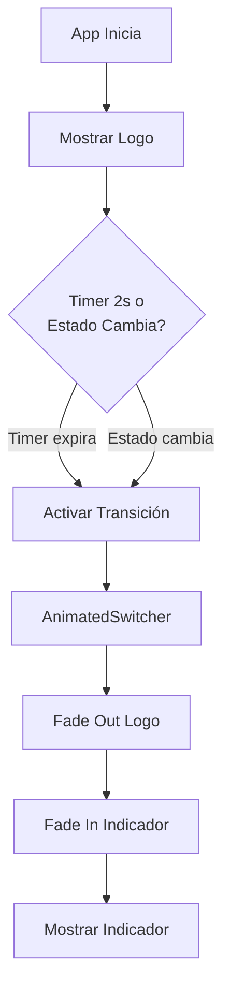

# Logo to Connectivity Transition - Documentación

## 🎯 Descripción

Widget inteligente que muestra el logo de la aplicación en el navbar inicialmente y transiciona automáticamente al indicador de conectividad cuando se cumple alguna de estas condiciones:

1. **Después de 2 segundos** de haber cargado la app
2. **Cuando el estado de conexión cambia** (ej: pierde conexión, recupera conexión, etc.)

## ✨ Características

### Transición Suave
- **FadeTransition**: Efecto de desvanecimiento
- **ScaleTransition**: Efecto de escala (0.8 → 1.0)
- **Duración**: 500ms con curva `easeInOutCubic`
- **Sin layout shift**: Tamaño fijo de 30x28 px

### Triggers de Transición
```dart
// Trigger 1: Timeout de 2 segundos
Future.delayed(const Duration(seconds: 2), () {
  setState(() => _showIndicator = true);
});

// Trigger 2: Cambio de estado de conexión
if (_lastStatus != status && !_showIndicator) {
  setState(() => _showIndicator = true);
}
```

## 🎨 Comportamiento Visual

### Estado Inicial (0-2 segundos o hasta cambio)
```
┌─────────┐
│  LOGO   │  ← Logo SVG de la empresa
└─────────┘
```

### Transición (500ms)
```
┌─────────┐
│ LOGO → ⚡│  ← Fade + Scale animado
└─────────┘
```

### Estado Final
```
┌─────────┐
│   ⚡    │  ← Indicador de conectividad
└─────────┘
```

## 🔧 Implementación Técnica

### Ubicación
- **Archivo**: `lib/widgets/logo_to_connectivity_transition.dart`
- **Usado en**: `lib/views/app_shell.dart` (AppBar)

### Estructura del Widget
```dart
LogoToConnectivityTransition (StatefulWidget)
  └─ State
     ├─ Timer (2 segundos)
     ├─ Connection Status Listener
     └─ AnimatedSwitcher
        ├─ Logo SVG (key: 'logo')
        └─ ConnectivityIndicator (key: 'indicator')
```

### Estados Internos
```dart
bool _showIndicator = false;        // Controla qué widget mostrar
ConnectionStatus? _lastStatus;      // Estado anterior de conexión
bool _hasInitialized = false;       // Evita transición en primer render
```

## 📊 Flujo de Ejecución



## 💡 Ventajas

### UX Mejorada
- ✅ **Branding primero**: Usuario ve el logo al iniciar
- ✅ **Transición contextual**: Solo cambia cuando hay información útil
- ✅ **Animación suave**: No es abrupto, es elegante
- ✅ **Respuesta inmediata**: Si hay problemas de conexión, se muestra al instante

### Performance
- ✅ **Sin layout recalculation**: Tamaño fijo
- ✅ **Lazy initialization**: Indicador solo se activa cuando se necesita
- ✅ **Single widget tree**: No mantiene ambos en memoria

### Código Limpio
- ✅ **Encapsulado**: Lógica contenida en un solo widget
- ✅ **Reutilizable**: Se puede usar en otros lugares
- ✅ **Testeable**: Estado y lógica claramente definidos

## 🎮 Uso

### En AppBar
```dart
// app_shell.dart
Row(
  children: [
    const LogoToConnectivityTransition(), // ← Simplemente úsalo
    const SizedBox(width: 12),
    // ... resto del navbar
  ],
)
```

### Personalización (si fuera necesario)
```dart
// Modificar duración de timer
Future.delayed(const Duration(seconds: 3), () { ... });

// Modificar animación
AnimatedSwitcher(
  duration: const Duration(milliseconds: 700), // Más lento
  switchInCurve: Curves.bounceIn,             // Diferente curva
  // ...
)

// Modificar tamaño
SizedBox(
  width: 40,  // Más ancho
  height: 32, // Más alto
  // ...
)
```

## 🧪 Casos de Uso

### Caso 1: App inicia con buena conexión
1. Usuario abre app → Ve logo
2. 2 segundos después → Transición suave al indicador
3. Como hay buena conexión → Indicador desaparece (por configuración)
4. Solo logo visible en el navbar

### Caso 2: App inicia sin conexión
1. Usuario abre app → Ve logo
2. Sistema detecta sin conexión → Transición inmediata (<2s)
3. Indicador rojo aparece → Usuario sabe que no hay Internet
4. Usuario arregla conexión → Indicador cambia a verde

### Caso 3: Conexión se pierde durante uso
1. App en uso → Logo visible (pasaron más de 2s)
2. Se pierde conexión → Indicador aparece inmediatamente
3. Usuario ve feedback visual claro
4. Conexión se recupera → Indicador puede ocultarse según config

## 📝 Notas Técnicas

### Por qué 2 segundos?
- **UX**: Tiempo suficiente para ver branding
- **Performance**: Tiempo para que el servicio de conectividad se inicialice
- **Balance**: No tan largo que sea molesto, no tan corto que sea imperceptible

### Por qué AnimatedSwitcher?
- **Flutter nativo**: No requiere dependencias adicionales
- **Eficiente**: Optimizado por el framework
- **Flexible**: Fácil de personalizar con diferentes transiciones
- **Child key**: Permite a Flutter saber qué widget reemplazar

### Gestión de Estado
- **ConsumerStatefulWidget**: Para acceder a Riverpod y tener estado local
- **Estado local** (`_showIndicator`): Para controlar la transición
- **Estado global** (Riverpod): Para escuchar cambios de conectividad

## 🔍 Debug

Para ver logs de la transición, agrega:
```dart
setState(() {
  print('🔄 Transicionando a indicador');
  _showIndicator = true;
});
```

Para verificar timing:
```dart
final stopwatch = Stopwatch()..start();
Future.delayed(const Duration(seconds: 2), () {
  print('⏱️ Transición después de ${stopwatch.elapsed}');
  // ...
});
```

## 🎯 Resultado Final

**Antes**: Logo estático → Siempre visible  
**Después**: Logo inteligente → Transiciona a información útil

Una experiencia más dinámica, informativa y pulida que mejora tanto el branding como la utilidad del navbar.

---

**Implementación completada ✅**
*Transición suave, inteligente y contextual entre logo e indicador de conectividad*
